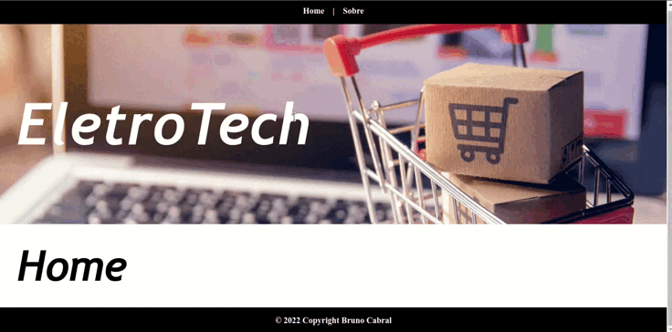
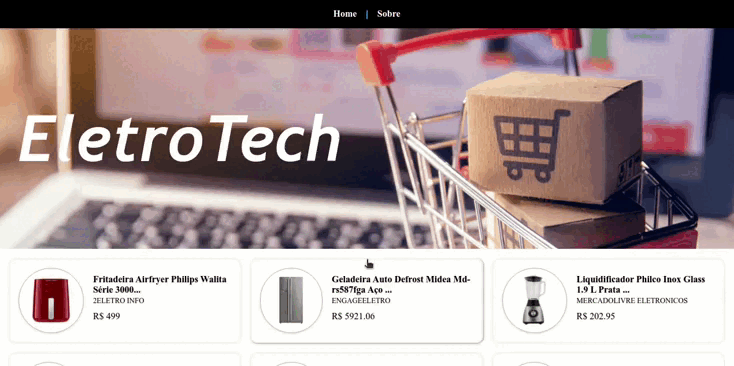
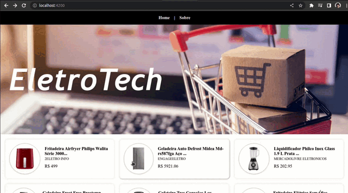

<h1 align="center">Angular Router - Angular 13</h1>

Aplicação desenvolvida com o objetivo de utilizar os conceitos de rotas estáticas e dinâmicas no Angular 13, utilizando um endpoint da API do Mercado Livre que retorna uma lista de Eletrodomésticos.

<h3 align="center">Rota Estática:</h2>

  

 
<h3 align="center">Rota Dinâmica:</h2>

  

 
 

  

